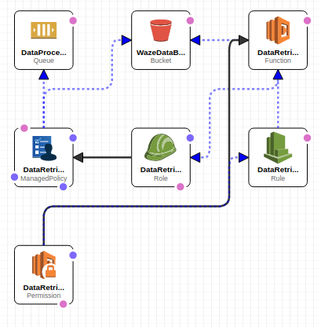

# WazeCCPProcessor

Takes [Waze CCP](https://www.waze.com/ccp) data feed and processes it in Amazon AWS for querying.

## Overview

Louisville is looking to create an automated AWS Waze processing solution that can be replicated by any CCP Partner.

You grab this Cloud Formation code and deploy the infrastructure stack to your AWS.

You enter your CCP data feed URL as a parameter.

Then you can analyze, query, extract live and historic data for your city.

## What is Completed

Currently we have a Cloud Formation template working that you can deploy.  

Right now it starts saving your CCP data as JSON files to an S3 bucket every 2 minutes, which you should be doing if you are a CCP partner.

Here are the steps to make it work:

1. Log into your own AWS console.
2. Created a new [S3 bucket](https://s3.console.aws.amazon.com/s3/home), *eg 'waze-artifacts-your-city'*. It needs read/write permissions only for your AWS console account. You only have to do this step one time.
3. Create your lambda functions. Run *'npm install'* on the *waze-data-download.js* code in **[code/lambda-functions/waze-data-download](code/lambda-functions/waze-data-download)**, then zip the results up. Make sure NVM, NPM, and Node are updated on your machine first.  Alternatively, you can use our zip file at **[code/lambda-functions/waze-data-download.zip](code/lambda-functions/waze-data-download.zip)**.
4. Upload the zip file from step 3 to the S3 bucket you created in step 2.  
5. Create a new [Cloud Formation](https://console.aws.amazon.com/cloudformation/home) stack and run the YAML at [infrastructure/cloudformation/WazeProcessorStack.yml](infrastructure/cloudformation/WazeProcessorStack.yml).
6. You will be prompted for 3 variables:
  * **EnvironmentName**: Enter name of the environment (Dev, Test, Prod, etc). This allows you to deploy and test updates easily.
  * **S3ArtifactsBucket**: Enter the S3 bucket name from step 2 where you put your Lambda functions from step 4.
  * **WazeDataHttpUrl**: Full URL to the Waze CCP data feed provided to you by Waze.

This creates a Cloud Formation (CF) stack which has all the infrastructure needed to ping your custom Waze CCP data feed every 2 minutes and save the JSON to a new bucket.  

Here's what was created, as seen in the Cloud Formation Designer:

You can update the CF stack with new YAML as the code here gets updated, and it only affects new and changed items. You can also remove all the AWS infrastructure automatically (minus the S3 bucket you created manually) by deleting the CF stack. 

## Current Plans

We are working on writing more of the Cloud Formation YAML to take the stored S3 JSON files and process them into an AWS relational database.

See our [Architecture Diagram](docs/Metro%20Waze%20Proposed%20Architecture.pdf) and [Requirements Doc](docs/Required%20infrastructure.txt) in our [docs folder](docs) for our blueprint of how we are proceeding. 

**We would like to collaborate with you!**  Please suggest updates, make a new branch and add to the CF YAML, collaborate on the Wiki, etc.  It would be great to work together to get the best solution and finish faster.   

We started with Cloud Formation directly, but if you would instead like to build out the code in [Terraform](http://www.terraform.io) please do so it can be deployed to any cloud provider. 

## Background

If you'd like a little more background on Louisville and what our city has been going with Waze and other mobility data, take a look at these links:

1. [Louisville Waze Internal Hackathon Recap](https://medium.com/louisville-metro-opi2/waze-louisvilles-first-internal-hackathon-647363a85392)
2. [Harvard Civic Analytics Network Presentation - Slides](https://docs.google.com/presentation/d/1esPVvhuIRjD199rN8aimK_XcmCt0pJOkjEIyCMhGKks/)